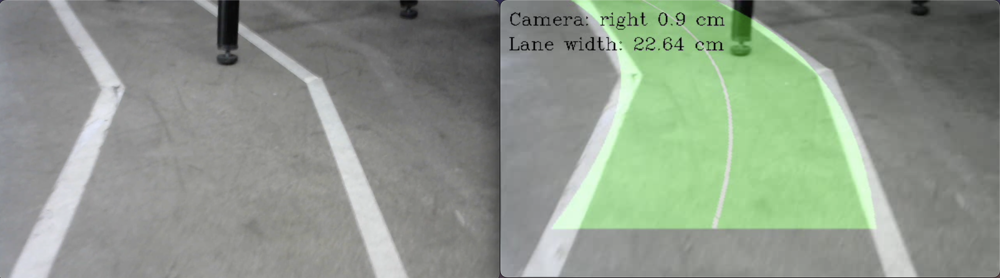

# lane-detection

In this project, we will write a program to detect MakerSpace's lane and its attributes such as width and midline using a Logitech camera. We will also embed the program into a Raspberry single-board computer to perform live detection.

There are 3 main files:
- `notebook_report.ipynb`: Detailed report of this project
- `main.py`: Program that detects lane in real time
- `main_video.py`: Program that detects lane from the input video